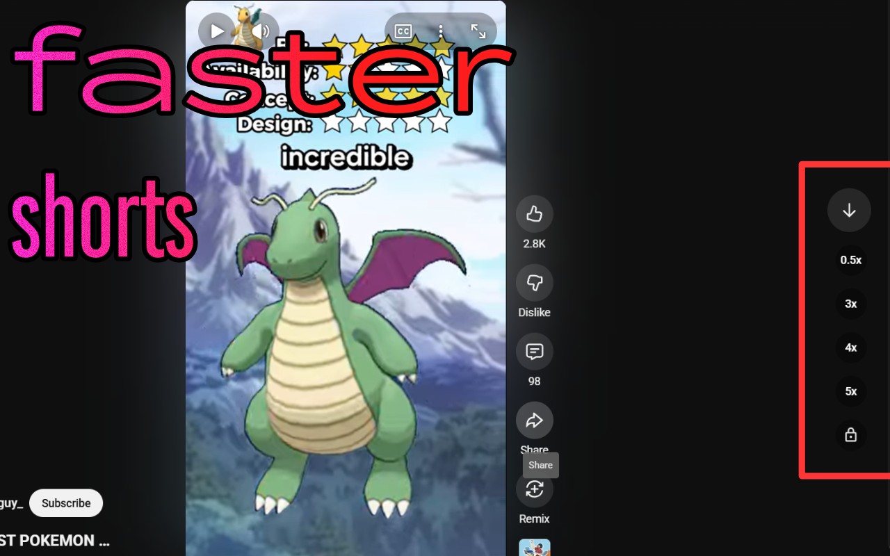

# Sensible YouTube speed controls
Adds speed controls to YouTube that actually make sense from a UX perspective!
it also adds a PIP button because right-clicking twice is absurd
[Check it out on the Chrome Store!](https://chromewebstore.google.com/detail/sensible-speed-youtube-3x/jnbkjmhennioljmldcpongmfocobdnbm?authuser=0&hl=en)

